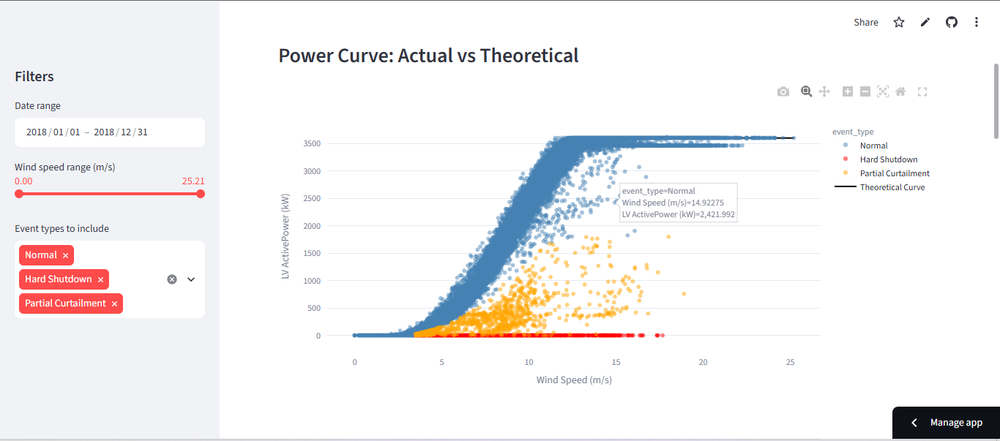

# 🌬️ Wind Farm SCADA Performance & Smart Grid Analytics Dashboard

An interactive Streamlit dashboard that analyzes real wind turbine SCADA data to detect and classify curtailment and anomaly events — with a specific focus on **Einspeisemanagement** (grid feed-in management), a German grid-regulation mechanism under the EEG (Erneuerbare-Energien-Gesetz).

🔗 **Live demo:**  https://wind-scada-fazeel.streamlit.app/





---

## Why this project

German grid operators can legally order wind farms to reduce their power feed-in when the local grid is congested — a mechanism called Einspeisemanagement. From the outside, a turbine producing far less power than expected for a given wind speed could mean one of two very different things:

1. **A genuine fault or shutdown** (maintenance, sensor failure, safety cutout)
2. **A deliberate, grid-ordered curtailment** (Einspeisemanagement)

Conflating these two is a real analytical mistake — they have completely different operational and financial implications for a wind farm operator. This dashboard builds a simple but meaningful classification layer to tell them apart, directly from raw SCADA telemetry.

## What it does

- **Loads and cleans** raw 10-minute-resolution SCADA data (wind speed, actual power, theoretical power curve, wind direction)
- **Classifies every data point** into one of three categories:
  - `Normal` — actual output matches the theoretical power curve
  - `Hard Shutdown` — power is exactly 0 kW despite wind speeds well above cut-in, indicating a likely fault or maintenance event
  - `Partial Curtailment` — power is reduced but non-zero, consistent with a genuine grid-ordered feed-in reduction
- **Visualizes the power curve** (actual vs. theoretical), color-coded by event type
- **Tracks performance over time** with daily average output and a 7-day rolling average
- **Surfaces seasonal patterns** by comparing monthly average wind speed against flagged-event frequency — revealing that curtailment/shutdown activity clusters heavily in winter months, correlating with higher wind speeds
- **Interactive filtering** by date range, wind speed range, and event type, with live-updating KPIs (capacity factor, shutdown count, curtailment count)

## Key finding

Flagged events (both hard shutdowns and partial curtailment) are heavily concentrated in **winter months (Jan–Mar, Oct–Dec)** and drop off sharply in summer. This pattern tracks closely with average monthly wind speed, suggesting that higher winter wind speeds — which push the turbine closer to rated and cut-out thresholds more often — are the primary driver of both safety-related shutdowns and grid curtailment events, rather than random maintenance scheduling.

## Tech stack

- **Python** (pandas for data processing)
- **Plotly** for interactive visualizations
- **Streamlit** for the dashboard interface

## Dataset

[EDP Wind Turbine SCADA Dataset](https://www.kaggle.com/datasets/berkerisen/wind-turbine-scada-dataset) — one year (2018) of 10-minute SCADA readings from a single wind turbine, including active power, wind speed, theoretical power curve, and wind direction.

## Running it locally

```bash
# Clone the repo
git clone https://github.com/YOUR-USERNAME/wind-scada-dashboard.git
cd wind-scada-dashboard

# Install dependencies
pip install -r requirements.txt

# Run the dashboard
streamlit run dashboard.py
```

The app will open automatically at `http://localhost:8501`.

## Project structure

```
wind-scada-dashboard/
├── data/
│   └── wind_data.csv          # SCADA dataset
├── dashboard.py                # Main Streamlit app
├── requirements.txt            # Python dependencies
└── README.md
```

## Possible extensions

- Multi-turbine fleet comparison (if additional turbine data is available)
- Thermal anomaly profiling using gearbox/generator/nacelle temperature data, if available
- Wake-effect analysis across turbines using wind direction data
- A rule-based or ML-based refinement of the curtailment threshold (currently a simple 50%-of-theoretical cutoff)

## Author

**Fazeel** — M.Eng. student in Renewable Energy Systems at Hochschule Nordhausen, Germany. Built as a portfolio project targeting Werkstudent and internship roles in the German energy sector.

[LinkedIn](https://www.linkedin.com/in/fazeel-darain-shaikh-026617143) · [GitHub](https://github.com/fazeelshaikh73733-tech)
